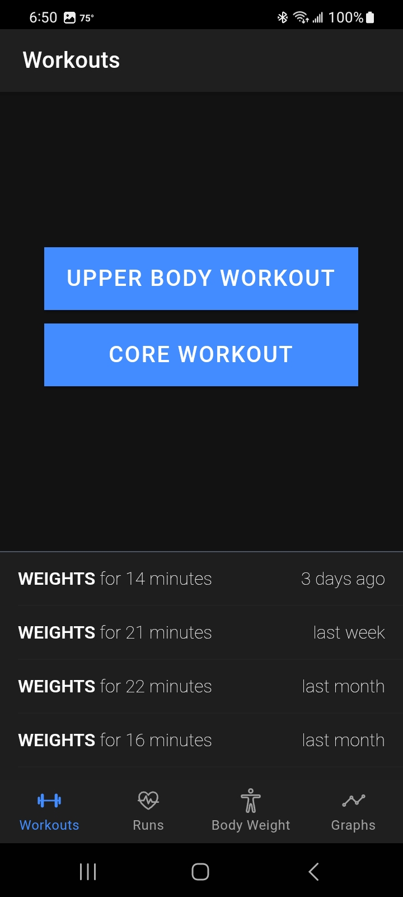
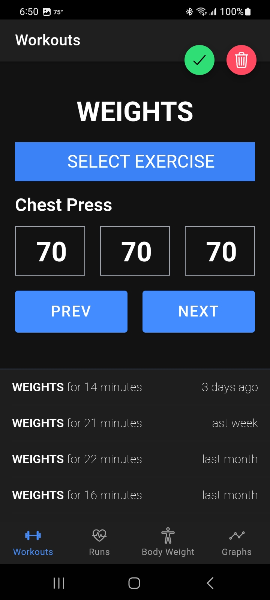
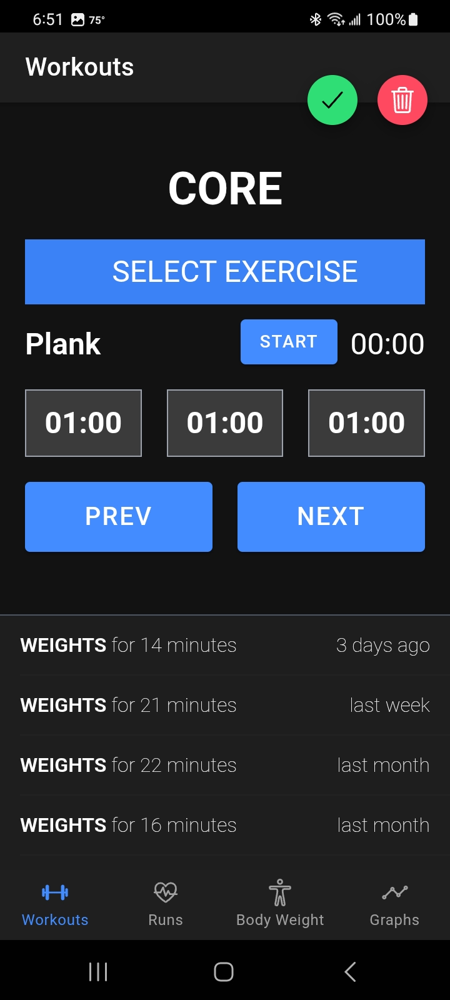
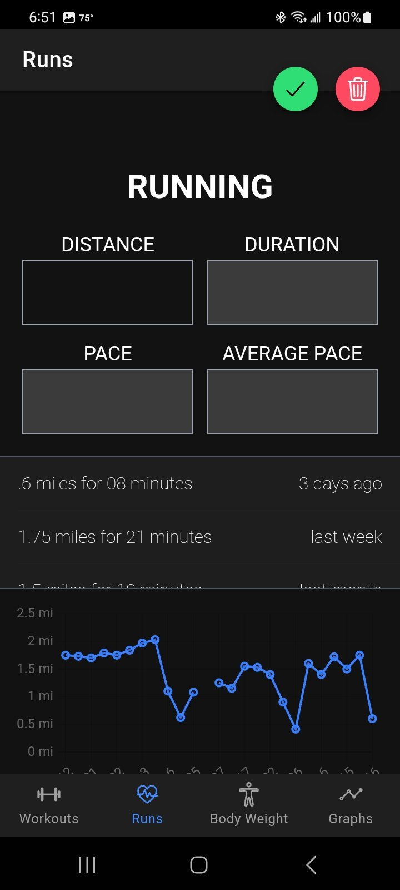
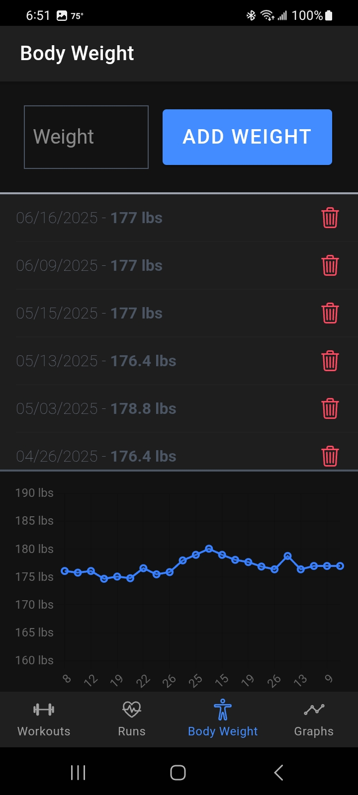
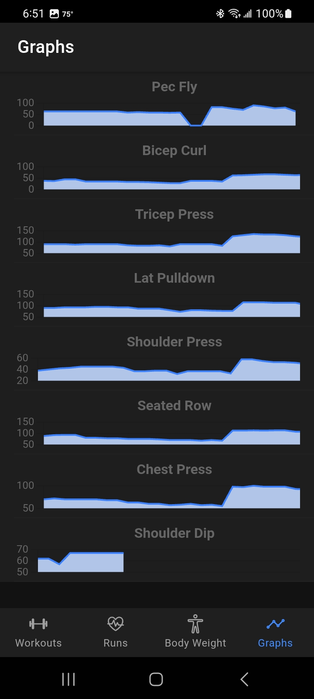

# Health Logger

**Health Logger** is a personal wellness tracking app built for mobile and web. It enables users to log daily metrics like weight, mood, and activity, and visualize trends using interactive charts.

## ✨ Features

- Track health metrics over time
- View trends with Chart.js visualizations
- Native Android app support via Capacitor
- Clean mobile-friendly UI with Ionic & TailwindCSS
- Built-in form masks and validation

### 📸 Screenshots

|  |  |  |
|:--:|:--:|:--:|
| Home Screen | Weight Lifting Log | Core Workout Log |

|  |  |  |
|:--:|:--:|:--:|
| Running Session | Weight Tracking | Spark Charts |

## 🧰 Tech Stack

### Core
- [Vue 3](https://vuejs.org/)
- [Ionic Framework](https://ionicframework.com/)
- [Capacitor](https://capacitorjs.com/)
- [Tailwind CSS](https://tailwindcss.com/)
- [TypeScript](https://www.typescriptlang.org/)

### Data Visualization
- [Chart.js](https://www.chartjs.org/)
- [vue-chart-3](https://vue-chart-3.netlify.app/)

### Tooling
- [Jest](https://jestjs.io/)
- [Cypress](https://www.cypress.io/)
- [ESLint + Prettier](https://eslint.org/)

